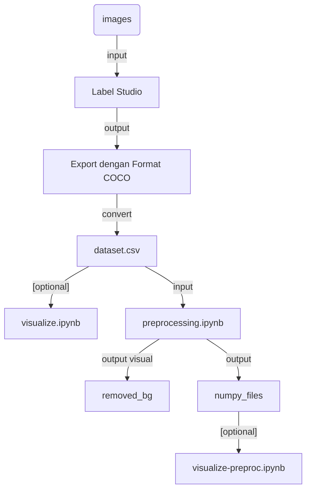
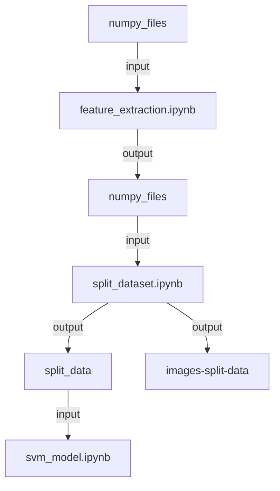

# DETEKSI KERUSAKAN PADA KARDUS

## Link dataset (Full)
- [object_detection_cardboard](https://drive.google.com/drive/folders/1Tzz94XEyqiADfEdvweKMCBZbdsS6KG6h?usp=sharing)

## Alur pengerjaan
- Pengambilan citra kardus dengan kondisi normal dan defect.
- Melakukan segmentasi area kerusakan pada citra dengan 3 kategori: hilang, penyok dan robek. Dibantu dengan aplikasi [`Label Studio`](https://labelstud.io/).
- Export hasil segmentasi ke format `coco`.
- Masuk ke file [coco_preprocess.ipynb](coco_preprocess.ipynb) untuk memproses hasil export ke csv. Akan menghasilkan file [dataset.csv](dataset.csv).
- Lakukan augmentasi untuk menambah variasi pada dataset dengan [augmentation.ipynb](augmentation.ipynb). Hasil augmentasi akan masuk ke [dataset.csv](dataset.csv).
- **(opsional)** Lakukan visualisasi untuk mengecek hasil dari file [dataset.csv](dataset.csv) menggunakan file [visualize.ipynb](visualize.ipynb).
- Masuk ke [preprocessing.ipynb](preprocessing.ipynb) untuk melakukan preprosesing pada dataset. Hasil dari preprosesing akan langsung disimpan pada folder [numpy_files](numpy_files) dalam format numpy (.npz).
- **(opsional)** Lakukan visualisasi untuk mengecek hasil dari preprosesing dataset menggunakan file [visualize-preproc.ipynb](visualize-preproc.ipynb).
- Melakukan ekstrasi fitur pada dataset yang telah melewati preprosesing dengan [feature_extraction.ipynb](feature_extraction.ipynb). Output dari ekstrasi fitur akan disimpan di folder [numpy_files](numpy_files).
- Dilanjutkan untuk di *split* setiap fitur yang akan dipakai menggunakan [split_dataset.ipynb](split_dataset.ipynb). Hasil split akan di simpan dalam format numpy (.npz) pada folder [split_data](numpy_files/split_data) yang ada di folder [numpy_files](numpy_files). Selain itu hasil dari split juga akan disimpan dalam bentuk *image* pada folder [images-split-data](images-split-data).
- Melakukan *train* dataset dengan algoritma CNN [svm_model.ipynb](svm_model.ipynb). Karena penggunaan CNN terbatas, maka hanya bisa melakukan klasifikasi kardus.

## `Folder: `
| Nama                                   | Isi                                                                                           |
| -------------------------------------- | --------------------------------------------------------------------------------------------- |
| [images](images)                       | Berisi citra original dari dataset yang kami gunakan                                          |
| [images-split-data](images-split-data) | Berisi *image* setiap feature yang telah di *split*                                           |
| [masking](masking)                     | Berisi citra masking pada kerusakan yang ada di dalam folder `images`                         |
| [removed-bg](removed-bg)               | Berisi citra yang telah di preproses dan terhapus background                                  |
| [visual](visual)                       | Berisi visualisasi folder `images` dengan kerusakan yang ada pada citra                       |
| [visual-preproc](visual-preproc)       | Berisi visualisasi folder `removed-bg` dengan kerusakan yang ada pada citra                   |
| [numpy_files](numpy_files)             | Berisi file numpy (.npy) yang mana berisi dataset yang siap dipakai untuk keperluan mendatang |

## `Files: `
| Nama                                                 | Isi                                                                          |
| ---------------------------------------------------- | ---------------------------------------------------------------------------- |
| [dataset.csv](dataset.csv)                           | Berisi dataset dari hasil export `Label-Studio`                              |
| [EDA.ipynb](EDA.ipynb)                               | Untuk melakukan *Exploratory Data Analysis* pada dataset kami                |
| [coco_preprocess.ipynb](coco_preprocess.ipynb)       | Untuk memproses dari hasil export berformat **coco ke csv**                  |
| [csv_preprocess.ipynb](csv_preprocess.ipynb)         | Untuk memproses lebih lanjut dari hasil export berformat **csv ke csv**      |
| [augmentation.ipynb](augmentation.ipynb)             | Untuk meng-augmentasi dataset                                                |
| [preprocessing.ipynb](preprocessing.ipynb)           | Melakukan preproses pada dile `dataset.csv`                                  |
| [test.ipynb](test.ipynb)                             | *Dummy file*                                                                 |
| [lbp.ipynb](lbp.ipynb)                               | Percobaan membuat fitur tekstur dengan algoritma Local Binary Pattern (LBP)  |
| [split_dataset.ipynb](split_dataset.ipynb)           | Untuk melakukan split dataset                                                |
| [visualize.ipynb](visualize.ipynb)                   | Untuk men-visualisasikan original citra dengan kerusakan yang dialami        |
| [visualize-preproc.ipynb](visualize-preproc.ipynb)   | Untuk men-visualisasikan citra hasil preproses dengan kerusakan yang dialami |
| [feature_extraction.ipynb](feature_extraction.ipynb) | Untuk melakukan ekstrasi fitur pada citra                                    |
| [svm_model.ipynb](svm_model.ipynb)                   | Pembuatan model svm untuk men-*train* dataset                                |

---

## Flowchart Pengerjaan

